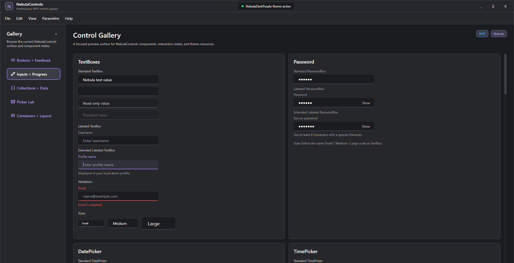
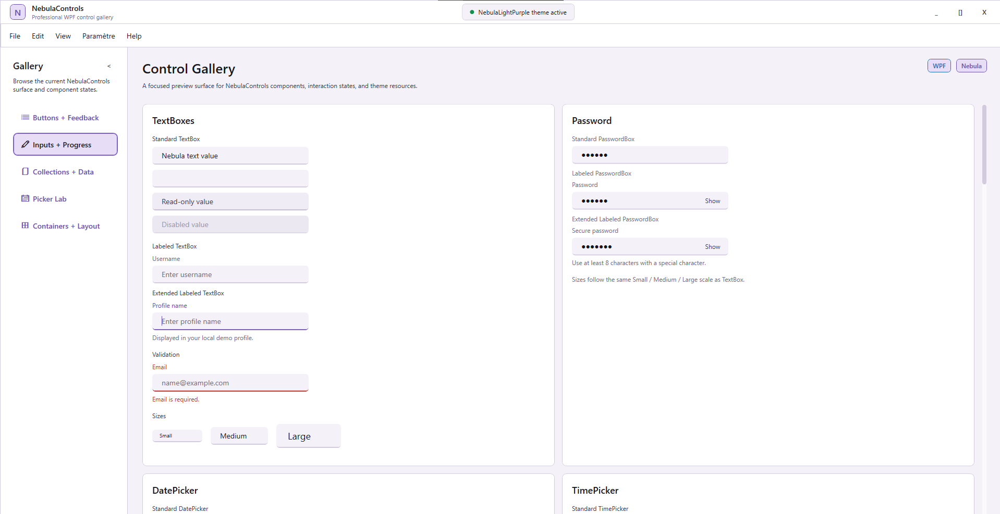
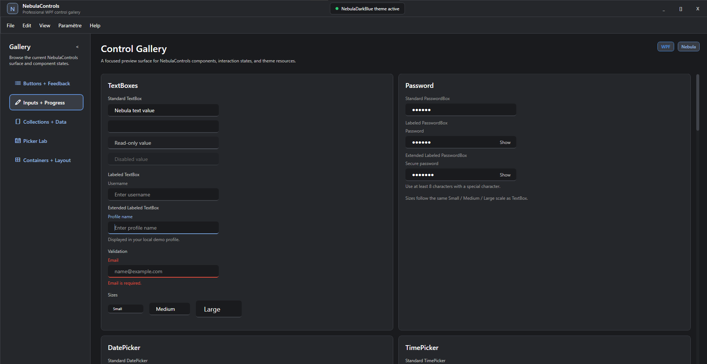

# NebulaControls

NebulaControls is a WPF control library for building desktop applications with a polished Nebula visual style, reusable controls, theme resources, and runtime theme switching.

Current release: `1.0.1-beta`

> Beta status: NebulaControls is usable and packaged, but some controls will continue to evolve based on real-world feedback.

## Highlights

- WPF control library targeting `net10.0-windows`
- Packable NuGet package
- Dark and light Nebula themes
- Runtime theme switching
- Public demo application
- Reusable styles for native WPF controls
- Custom controls for inputs, pickers, feedback, data, layout, and navigation

## Themes

NebulaControls currently includes three themes:

- `NebulaDarkPurple`
- `NebulaDarkBlue`
- `NebulaLightPurple`

The default demo theme is `NebulaDarkPurple`.

Runtime switching is available through:

```csharp
NebulaThemeManager.ApplyTheme(NebulaTheme.NebulaDarkPurple);
NebulaThemeManager.ApplyTheme(NebulaTheme.NebulaDarkBlue);
NebulaThemeManager.ApplyTheme(NebulaTheme.NebulaLightPurple);
```

## Screenshots

### NebulaDarkPurple



### NebulaLightPurple



### NebulaDarkBlue



More screenshots:

- [NebulaDarkPurple pickers](docs/images/nebula-dark-purple-pickers.png)
- [NebulaDarkPurple selection controls](docs/images/nebula-dark-purple-selection.png)

## Available Controls

### Actions and Feedback

- Buttons: primary, secondary, ghost, subtle, danger, warning
- `NebulaAlert`
- `NebulaBadge`
- `NebulaDialog`
- `NebulaRating`
- `NebulaSpinner`
- `NebulaToast`

### Inputs

- `NebulaTextBox`
- `NebulaLabeledTextBox`
- `NebulaPasswordBox`
- `NebulaLabeledPasswordBox`
- `NebulaSearchBox`
- `NebulaNumericUpDown`
- `NebulaDatePicker`
- `NebulaTimePicker`
- `NebulaDateTimePicker`

### Selection

- `NebulaCheckBox`
- `NebulaRadioButton`
- `NebulaToggleButton`
- `NebulaComboBox`
- `NebulaChip`

### Collections and Data

- `NebulaListBox`
- `NebulaTreeView`
- `NebulaDataGrid`
- Nebula scrollbars

### Containers and Layout

- `NebulaTabControl`
- `NebulaExpander`
- `NebulaGroupBox`
- `NebulaWindow`
- `NebulaAvatar`
- `NebulaToolTip`
- Nebula menu and context menu styles

## Quick Start

Add the package reference:

```xml
<PackageReference Include="NebulaControls" Version="1.0.1-beta" />
```

Load one theme dictionary and the global controls dictionary in `App.xaml`:

```xml
<Application.Resources>
    <ResourceDictionary>
        <ResourceDictionary.MergedDictionaries>
            <ResourceDictionary Source="pack://application:,,,/NebulaControls;component/Themes/NebulaDarkPurple/Theme.xaml" />
            <ResourceDictionary Source="pack://application:,,,/NebulaControls;component/Controls/NebulaControls.xaml" />
        </ResourceDictionary.MergedDictionaries>
    </ResourceDictionary>
</Application.Resources>
```

Add the controls namespace where custom Nebula controls are needed:

```xml
xmlns:nebula="clr-namespace:NebulaControls.Controls;assembly=NebulaControls"
```

Use custom controls:

```xml
<nebula:NebulaTextBox
    Style="{StaticResource NebulaLabeledTextBox}"
    Label="Username"
    Placeholder="Enter username"
    HelperText="Displayed in your profile." />
```

Use Nebula styles on native WPF controls:

```xml
<Button Content="Save" Style="{StaticResource NebulaPrimaryButton}" />
<TextBox Style="{StaticResource NebulaTextBox}" />
```

## Local Package

Build the local package from the repository root:

```powershell
dotnet pack src/NebulaControls/NebulaControls.csproj -c Release
```

The package is written to:

```text
artifacts/packages
```

For the current beta, the generated package is:

```text
NebulaControls.1.0.1-beta.nupkg
```

## Demo

The repository includes a WPF demo application:

```powershell
dotnet run --project samples/NebulaControls.Demo/NebulaControls.Demo.csproj
```

The demo is the best way to inspect the current control surface, validate theme switching, and test interactive behavior.

## Repository Layout

- `src/NebulaControls`: packable WPF control library
- `samples/NebulaControls.Demo`: public demo application using a project reference
- `docs`: usage notes, release notes, and planning documents
- `artifacts/packages`: local NuGet packages generated by `dotnet pack`

## Known Beta Notes

- The package is ready for early testing, but the visual language may still evolve.
- `NebulaDataGrid` is validated with an editable SQLite demo scenario; sorting and filtering are planned for a later version.
- `NebulaTabControl` is currently top-only. A dedicated old-school overlapping tab style may be explored later.
- Additional controls and refinements are planned after public feedback.

## Roadmap

- Improve public documentation and screenshots
- Add more real-world demo scenarios
- Continue finalizing controls based on feedback
- Refine `NebulaWindow` with future shell features
- Revisit old-school `NebulaTabControl` styling in a focused phase
- Prepare a stable `1.0.0` after beta feedback

## Documentation

See [docs/NebulaControlsUsage.md](docs/NebulaControlsUsage.md) for setup and usage examples.

See [docs/ThemesAndTheming.md](docs/ThemesAndTheming.md) for the difference between visual theme resources and runtime theme switching code.
